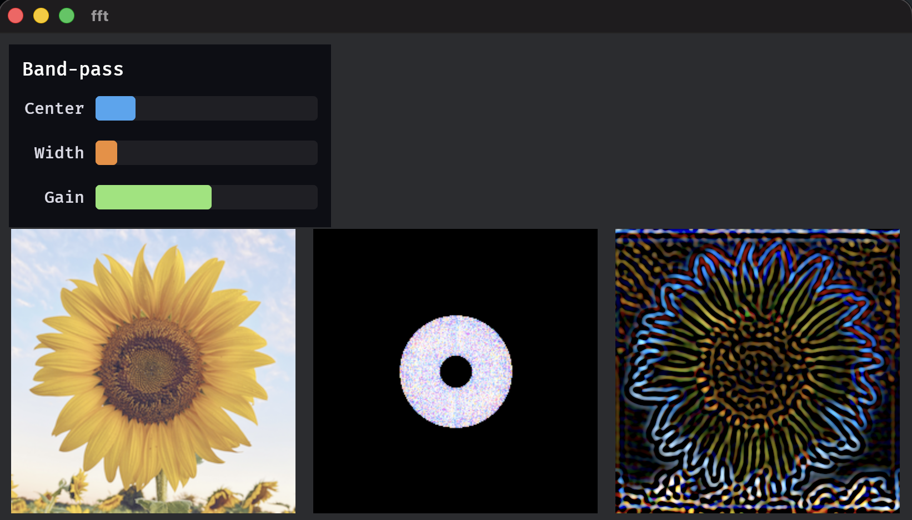

# bevy_fft

This crate is a small GPU **FFT library** for [Bevy](https://bevyengine.org). It includes a 2D forward and inverse path with ping-pong buffers, plus a place to run spectrum-domain compute between the two passes. It ships with a sample app that applies a radial band-pass on the spectrum in the middle of the pipeline.



## What it includes

The stock pipeline is built around a **256×256** complex transform with workspace tiles labeled **A** through **D**. After the graph finishes, resolved images **`spatial_output`** and **`power_spectrum`** are available for sampling. The Rust API exposes **`FftPlugin`**, **`FftSource`**, **`FftSchedule`**, **`FftInputTexture`**, **`FftInputDomain`**, and **`FftPatternTarget`**. Run `cargo doc --open` for generated API documentation, or open [`src/fft/mod.rs`](src/fft/mod.rs) as the source of truth.

Between **`ComputeFFT`** and **`ComputeIFFT`** the graph visits **`SpectrumPass`**, which is a no-op until something is wired in. Call **`splice_spectrum_pass`** after registering your own Core2d compute node, and reuse **`FftBindGroupLayouts::common`** to match FFT bindings.

There is also an [**ocean**](src/ocean/mod.rs) entry point. **`OceanPlugin`** loads a vertex shader **`OCEAN_MESH`** that displaces a mesh using a height texture such as **`FftTextures::spatial_output`**. That shader is a building block, not a complete water renderer.

Ambitious extras such as a full ocean sim or FFT bloom are sketched in [**`ROADMAP.md`**](ROADMAP.md).

## Try it

Generate optional test patterns if you like.

```bash
pip install numpy matplotlib pillow
python assets/generate_test_patterns.py
```

Then run the demo. The **`file_watcher`** feature hot-reloads WGSL while you iterate.

```bash
cargo run --example fft --features file_watcher
```

The **`fft`** example drives **`FftSchedule::ForwardThenInverse`**. Data starts in spatial **A**, moves to spectrum **C** for a radial band-pass tuned with the sliders at the top-left, then returns through IFFT to **B**.

## A few types worth knowing

Pick **`FftSchedule`** to control how much runs each frame. **`Forward`** stops after the transform into **C**. **`Inverse`** assumes **C** is already filled and writes **B**. **`ForwardThenInverse`** runs both passes so spectrum buffer **C** can be edited on the GPU between them.

**`FftInputDomain`** steers where **`FftInputTexture`** lands on the CPU each update, either spatial **A** in **`Spatial`** mode or spectrum **C** in **`Spectrum`** mode. **`FftPatternTarget`** tells procedural shaders whether to write **A** or **C**, in line with the uniform in [`bindings.wgsl`](src/fft/bindings.wgsl). Most apps import from **`bevy_fft::fft::prelude`** and add **`bevy_fft::ocean`** only when using the mesh shader.

Textures use **Rgba32Float** pairs for real and imaginary storage. Kernels currently launch **256** threads per row. The ping-pong layout is meant to grow to bigger grids later. Broader wishes such as 1D or 3D FFTs and packed formats stay in [`ROADMAP.md`](ROADMAP.md).
