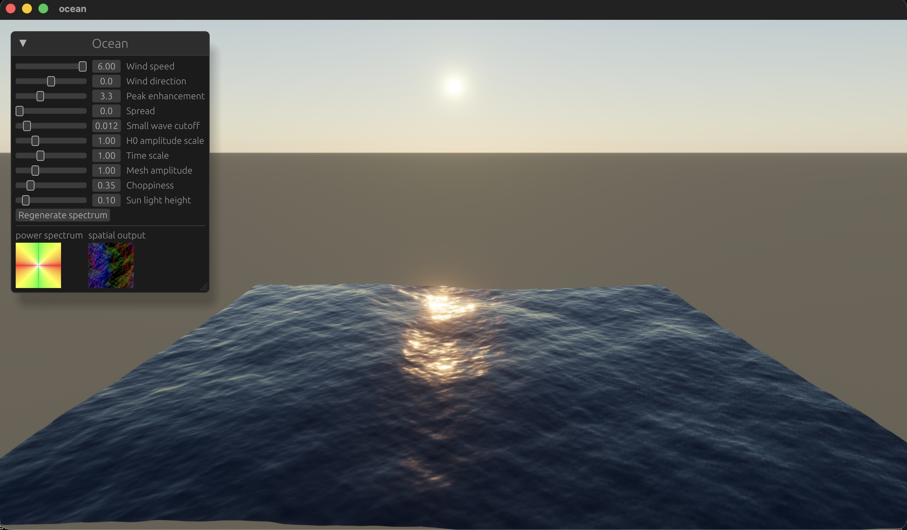
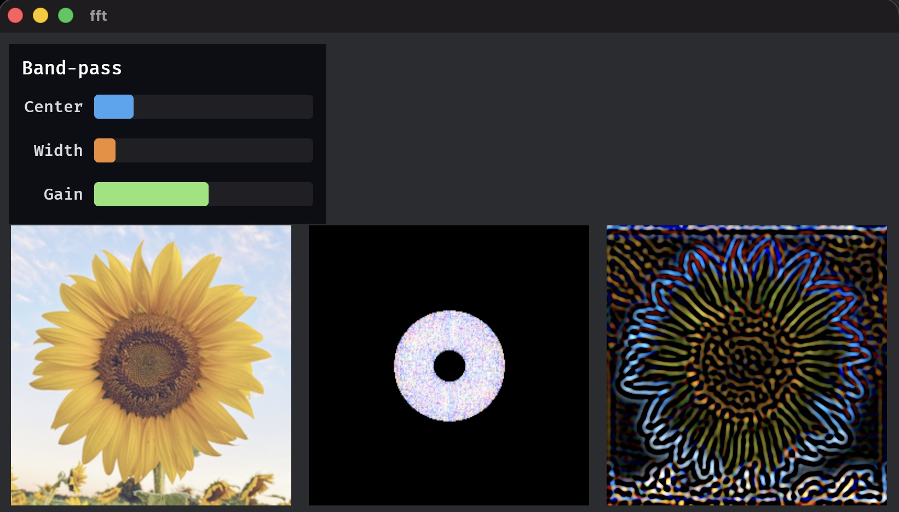

# bevy_fft

This crate is a small GPU FFT library for [Bevy](https://bevyengine.org). Use it when you want to filter or synthesize data in the frequency domain on the GPU, then turn it back into something you can show on screen or feed into a mesh, for example a height field from an ocean-style spectrum. It plugs into Bevy’s render graph and works with square power-of-two grids.

The fft example applies a radial band-pass in that spectrum stage. The ocean example runs an inverse-only path each frame and displaces a mesh from the resolved spatial height and slopes.





## What it includes

The stock pipeline uses your chosen grid edge length as long as it is a non-zero power of two. Helpers such as `FftSource::square_forward_then_inverse(n)` and `square_inverse_only(n)` set `FftTextures` and schedule work. After the graph finishes, resolved images `spatial_output` and `power_spectrum` are available for sampling. The Rust API exposes `FftPlugin`, `FftSource`, `FftSchedule`, `FftInputTexture`, `FftInputDomain`, and `FftPatternTarget`. Run `cargo doc --open` for generated API documentation, or open [`src/fft/mod.rs`](src/fft/mod.rs) as the source of truth.

FFT compute runs on the root [`RenderGraph`](https://docs.rs/bevy_render/latest/bevy_render/render_graph/graph/struct.RenderGraph.html) so it executes once per frame before camera work (the graph ends with `ResolveOutputs` → `CameraDriverLabel`). The chain is `ComputeFFT` → `SpectrumPass` → `ResolveSpectrum` → `ComputeIFFT` → `ResolveOutputs`. Between forward and inverse FFT the graph visits `SpectrumPass`, which is a no-op until something is wired in. Register your custom node on that same root graph, call `splice_spectrum_pass` from plugin `finish`, and reuse `FftBindGroupLayouts::common` to match FFT bindings.

There is also an [ocean](src/ocean/mod.rs) entry point. `OceanPlugin` splices ocean spectrum compute into the FFT graph and registers `OceanSurfaceMaterial`, which displaces a mesh using `FftTextures::spatial_output`. Register `FftPlugin` before `OceanPlugin` so plugin `finish` ordering is valid. It is a building block, not a complete water renderer.

The [shallow_water](src/shallow_water/mod.rs) module is separate from the bulk FFT entity path: GPU staggered shallow water (see [docs/shallow_water.md](docs/shallow_water.md)) with a PBR surface example.

The [ewave](src/ewave/mod.rs) module runs Tessendorf-style iWave in k-space with its own FFT buffers; `cargo run --example ewave` shows a periodic heightfield next to the same stock graph path. Register `FftPlugin` before `EwavePlugin` for the same reason.

### FFT and k-space indexing

The stock FFT places DC at index `(0,0)` on each axis, with the usual positive-then-wrapped-negative frequency order. If you add a per-texel multiply in frequency space, map each `(i, j)` to `(k_x, k_y)` with that same layout. A centered `2π (i - N/2) / L` style grid only matches the buffers if the spectrum is explicitly shifted, which the ocean path does when writing to buffer C. The eWave shader entry `ewave_k_step` in [`assets/ewave/ewave.wgsl`](assets/ewave/ewave.wgsl) follows the FFT-aligned convention. The module docs in `src/ewave/mod.rs` state the same rule for this crate’s FFT.

Ambitious extras such as a full ocean sim or FFT bloom are sketched in [`ROADMAP.md`](ROADMAP.md).

## Try it

Generate optional test patterns if you like.

```bash
pip install numpy matplotlib pillow
python assets/generate_test_patterns.py
```

Then run the demo. The `file_watcher` feature hot-reloads WGSL while you iterate.

```bash
cargo run --example fft --features file_watcher
cargo run --example ocean --features free_camera
cargo run --example shallow_water --features free_camera
cargo run --example ewave --features free_camera
```

The `fft` example drives `FftSchedule::ForwardThenInverse`. Data starts in spatial A, moves to spectrum C for a radial band-pass tuned with the sliders at the top-left, then returns through IFFT to B. The `ocean` example uses `FftSchedule::Inverse` with `OceanPlugin`: a compute pass fills spectrum C each frame, then the same IFFT and resolve path writes `spatial_output` for the ocean material.

## A few types worth knowing

Pick `FftSchedule` to control how much runs each frame. `Forward` stops after the transform into C. `Inverse` assumes C is already filled and writes B. `ForwardThenInverse` runs both passes so spectrum buffer C can be edited on the GPU between them.

`FftInputDomain` steers where `FftInputTexture` lands on the CPU each update, either spatial A in `Spatial` mode or spectrum C in `Spectrum` mode. `FftPatternTarget` tells procedural shaders whether to write A or C, in line with the uniform in [`bindings.wgsl`](src/fft/bindings.wgsl). `bevy_fft::prelude` re-exports what the in-repo examples use, including `FftInputTexture` and `prepare_fft_bind_groups`. Deeper or rarely used symbols remain on `bevy_fft::fft` and `bevy_fft::fft::resources`.

Workspace buffers use Rgba32Float real and imaginary textures. Radix-2 butterfly stages use `256 × 1` workgroups and a 2D dispatch over half-width butterflies and full grid lines. The WGSL [`c32`](src/complex/c32.wgsl) helpers can pack one complex as two f16 in a single `u32`, but the stock FFT graph is still wired to float storage only. 1D or 3D FFTs, packed uint buffers, and related layout work stay in [`ROADMAP.md`](ROADMAP.md).

### How large can the grid be?

Today the twiddle table in Rust and WGSL is a fixed `8192` complex table filled for butterfly bases up through `2^12`, which matches a full radix-2 pass schedule for `4096 × 4096` rows and columns. On top of that, the GPU enforces its own max texture dimension. This is commonly 8192 or 16384 on many desktop adapters for 2D storage textures.